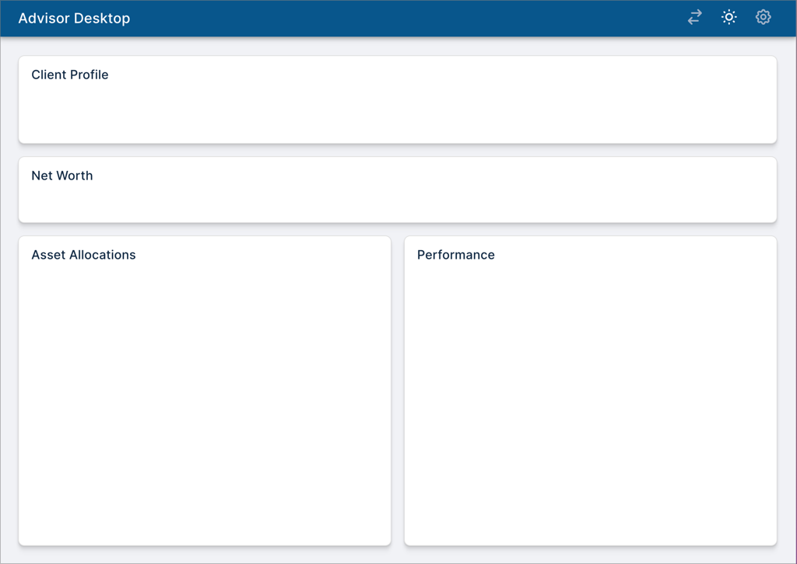
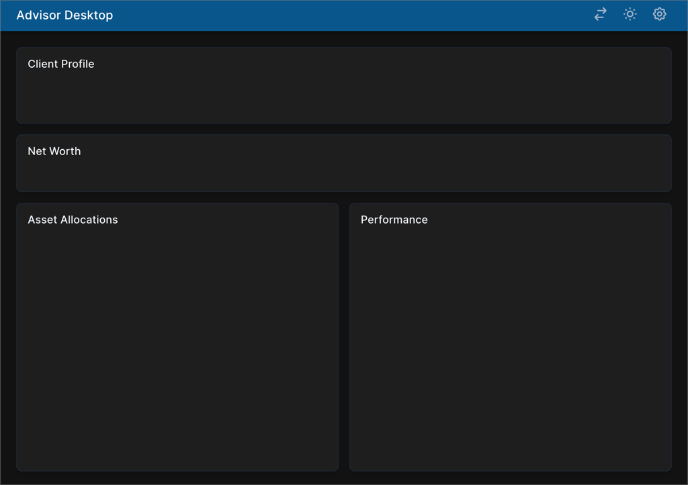
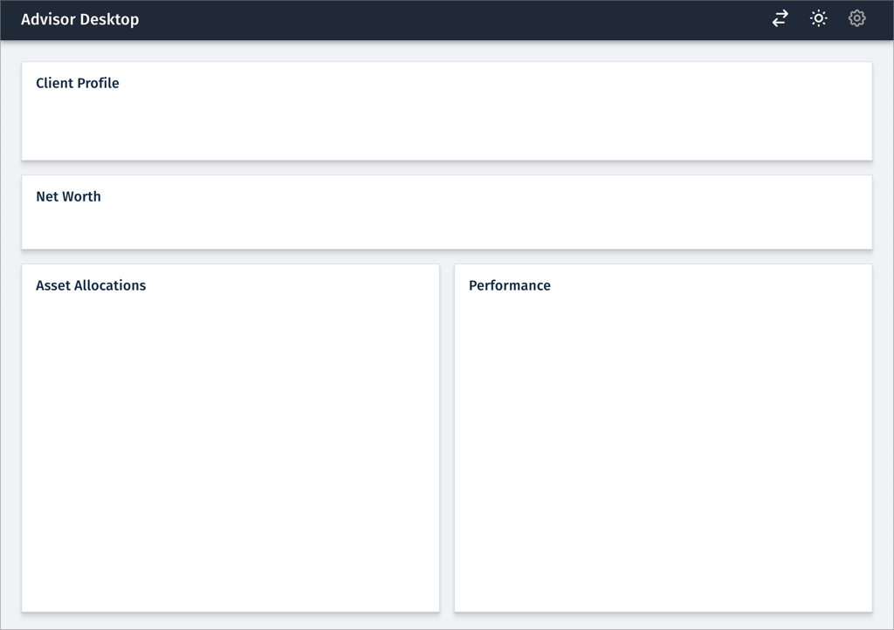
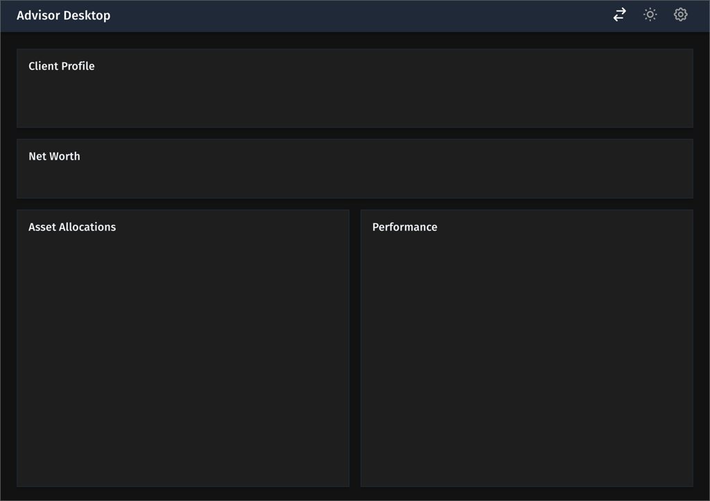
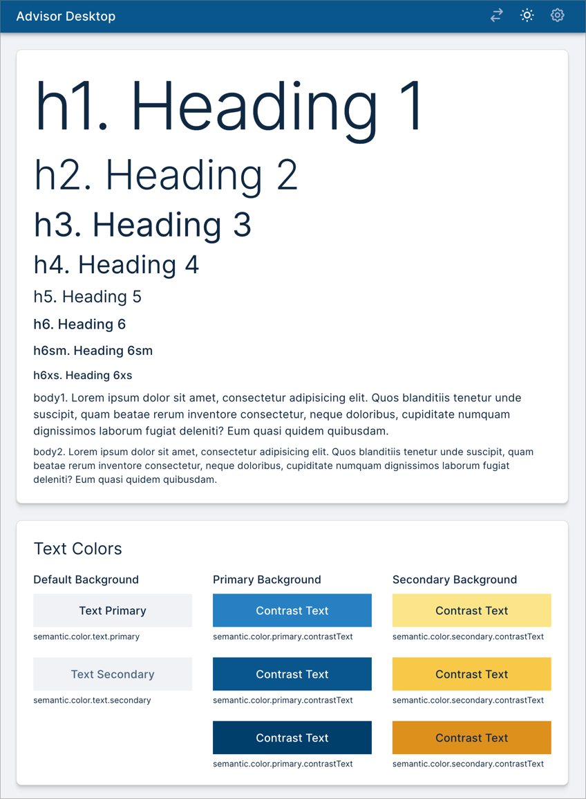

# Design Tokens Demo

Sample application to demonstrate a design workflow that keeps design and code
in sync using design tokens. Also shows how tokens can be layered to specify
multiple brands and light vs. dark mode.

See [main.css](apps/advisor-desktop-css/src/main.css) for the definitions of CSS
rules and variables. Note that CSS variables are categorized under 6 selectors:

1. `:root`
2. `.semantic`
3. `.brand1-light`
4. `.brand1-dark`
5. `.brand2-light`
6. `.brand2-dark`

The `:root` selector is always active by definition. The `.semantic` selector is
always applied to the `<html>` element. Finally, depending on the brand and mode
selected by the user, one of the last 4 selectors is applied to the `<html>`
element. See the `setTheme()` function in
[Header.tsx](apps/advisor-desktop-css/src/components/Header.tsx) to see how this
is done.

It is interesting to note that brand1 and brand2 use different font families
(Inter and Fira-Sans respectively). This is done by setting the value of
`semantic-font-family-sans` variable to `Inter` in the semantic layer and
overriding with `Fira Sans` in the `brand2-light` and `brand2-dark` layers (see
main.css).

The Figma file for this project can be found
[here](https://www.figma.com/community/file/1087643130213620036). It is the
source of truth for the design tokens used in this project.

#### Brand 1 (light mode)

Font is Inter.



#### Brand 1 (dark mode)



#### Brand 2 (light mode)

Note font change to Fira Sans.



#### Brand 2 (dark mode)



#### Design System



## Development Build

To develop all apps and packages, run the following command:

```
# Install dependencies
npm ci

# Generate styles from tokens
npm run token-pipeline

# Run the app
npm run dev
```

Point your browser http://localhost:3000/ to see the running application.

> Note: Do not run `npm install` in any of the subdirectories. It will break the
> build. There should be only one `package-lock.json` file in the entire repo
> (at the root).

## Production Build

To build all apps and packages, run the following command:

```
npm ci
npm run token-pipeline
npm run build
```
