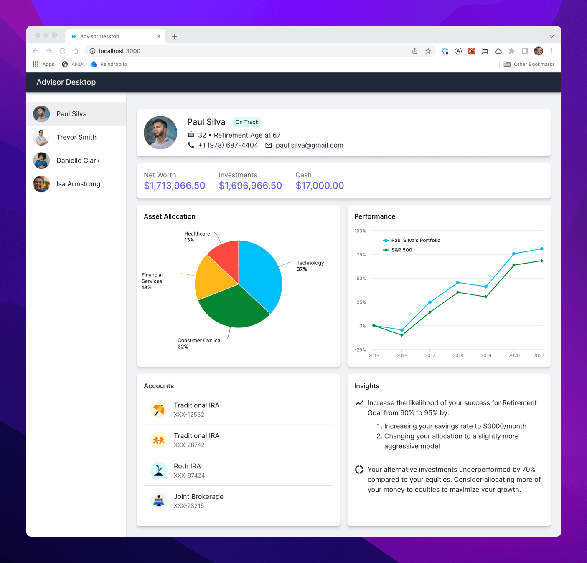

# Design Tokens Demo

Sample application to demonstrate a design system pipeline that allows a design
and code to remain in sync using design tokens.



## Development Build

To develop all apps and packages, run the following command:

```
npm install
npm run dev
```

Point your browser http://localhost:3000/ to see the running application.

> Note: Do not run `npm install` in any of the subdirectories. It will break the
> build. There should be only one `package-lock.json` file in the entire repo
> (at the root).

## Production Build

To build all apps and packages, run the following command:

```
npm install
npm run build
```
